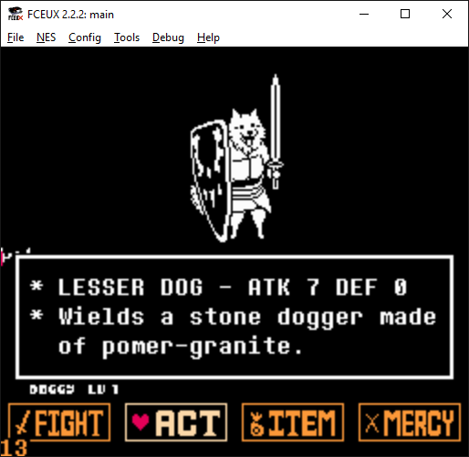

# Undertale NES demo



This is a work in progress!

This is a fun little NES hombrew project I started.
It recreates the Lesser Dog battle from Undertale.

## How to build

You will need gcc, make and Python 3.5 to build this project.

Simply run `make` in your terminal of choice:

```bash
$ make
```

## How to play the game

The build process will create a NES ROM file in bin/main.nes.
You will need an emulator to play the game.
I recommend using [FCEUX](http://www.fceux.com/web/home.html).
